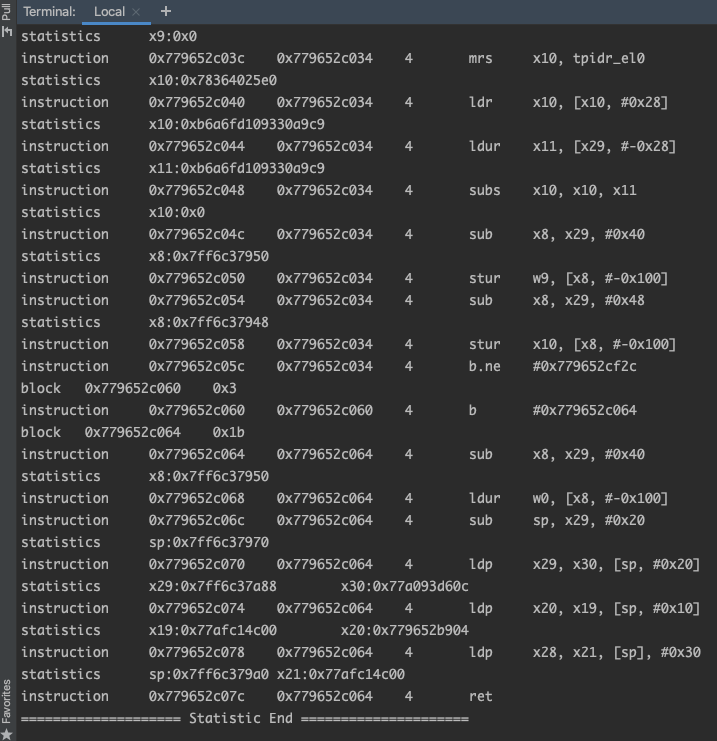

# sktrace
- frida 14
> 原理是重编译， 在调入下一个汇编基本块之前，插入frida 代码，这样他就知道下一个基本块内容了，再进行重定位输出，难点在于指令的修正、地址修复（非常复杂，所以 stalker 最开始只支持了 64 位， 2020.5月才支持了 32位， 目前 32 位容易崩掉）所以在 32 位下使用 stalker 最好是控制在函数粒度上使用，防止 bug 崩溃

## 0x0
1. 类似 ida 指令 trace 功能
2. 统计寄存器变化，辅助分析，并且可能会有字符串产生

# 0x1
`python3 sktrace/sktrace.py -m attach -l soName -i nativeFunction package`

# 0x2

即可完成跟踪